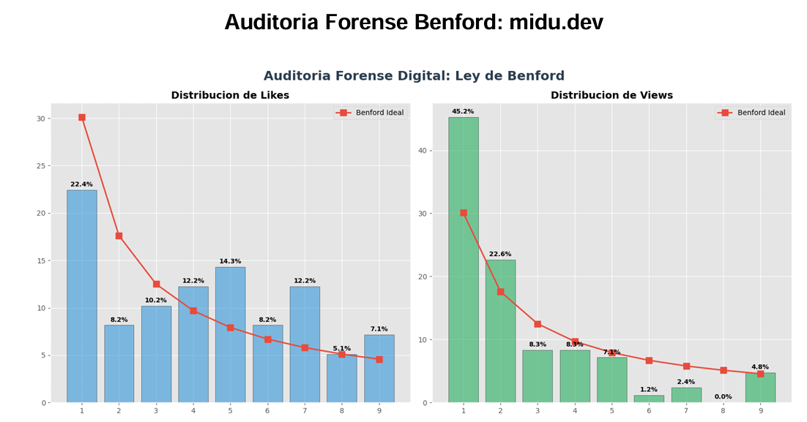
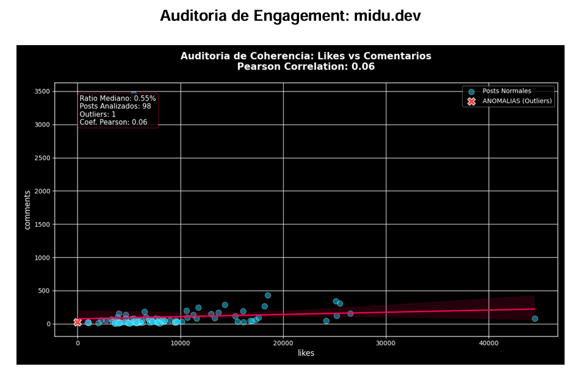

# Auditoría Forense de Instagram

Este proyecto es una herramienta de auditoría avanzada para perfiles de Instagram. Utiliza técnicas de análisis estadístico (Ley de Benford) y análisis de comportamiento (Engagement) para detectar posibles anomalías, uso de bots o manipulación de interacciones.

## Características Principales

- **Scraping Automatizado**: Extrae datos de posts y reels utilizando Playwright.
- **Auditoría de Benford**: Analiza la distribución del primer dígito en likes y visualizaciones para detectar comportamientos no naturales.
- **Análisis de Engagement Pro**: Evalúa la relación entre likes y comentarios, identificando outliers y anomalías de interacción.
- **Reportes Inteligentes**: Genera informes detallados en PDF con gráficos y diagnósticos impulsados por IA (Groq/Llama 3).

## Estructura del Proyecto

- `main.py`: Orquestador principal que ejecuta todo el flujo de trabajo.
- `analizador_benford.py`: Realiza el análisis estadístico basado en la Ley de Benford.
- `analizador_engagement.py`: Analiza la coherencia del engagement y detecta anomalías.
- `ReactionsScraper.py`: Módulo encargado de la extracción de datos desde Instagram.
- `SessionCookies.py`: Gestiona la autenticación manual para evitar bloqueos.
- `utils_report.py`: Utilidades para la generación de reportes en PDF.
- `image/`: Carpeta que contiene capturas de ejemplo de los análisis.

## Visualizaciones de Ejemplo

### 1. Análisis de Benford
Muestra la desviación de los datos reales frente a la distribución teórica de Benford.


### 2. Análisis de Engagement
Gráfico de dispersión que identifica la correlación entre likes y comentarios, resaltando posibles outliers.


## Instalación

1. Clona el repositorio.
2. Crea un entorno virtual e instálalo:
   ```bash
   python -m venv .venv
   source .venv/bin/activate  # En Windows: .venv\Scripts\activate
   pip install -r requirements.txt
   ```
3. Instala los navegadores de Playwright:
   ```bash
   playwright install chromium
   ```

## Configuración

Crea un archivo `.env` en la raíz del proyecto y añade tu API Key de Groq:
```env
GROQ_API_KEY=tu_api_key_aqui
```

## Uso

### Paso 1: Guardar Sesión
Para evitar bloqueos, primero debes guardar tu sesión de Instagram (solo es necesario hacerlo una vez):
```bash
python SessionCookies.py
```
Se abrirá una ventana del navegador. Inicia sesión manualmente y espera a que la ventana se cierre sola.

### Paso 2: Ejecutar Auditoría
Ejecuta el orquestador principal e introduce el nombre de usuario que deseas analizar:
```bash
python main.py
```

## Requisitos de Sistema

- Python 3.8+
- Conexión a Internet
- Cuenta de Groq para el análisis por IA

---
*Nota: Esta herramienta es para fines de investigación y auditoría. Asegúrate de cumplir con los términos de servicio de la plataforma.*
